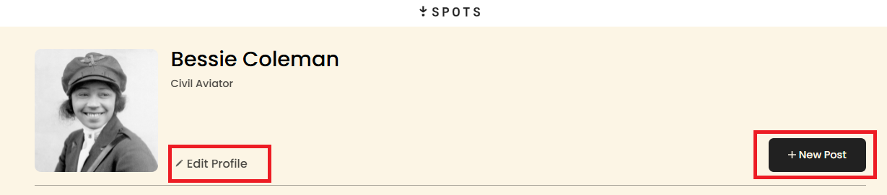
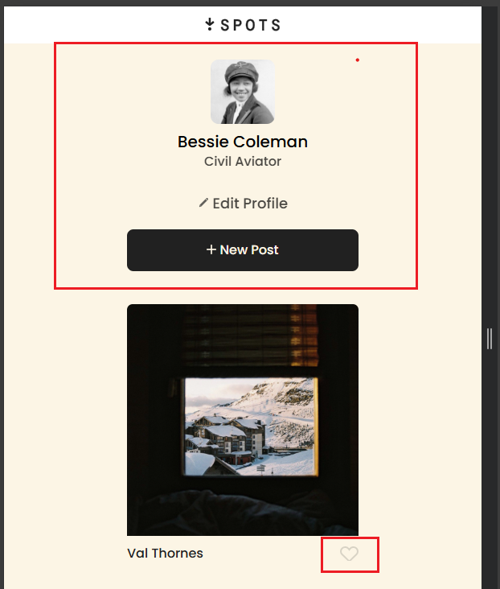

# Spots

An website created for share imagens.

## Overview  

Spots is a website that allows users to upload, share, and interact with images. The platform focuses on the connect people throught imagens and with the interactivity of the website they can express how they feel wit each photo upload by the users.

## Tech Stack
- HTML5
- CSS3
- Responsive design

## Features
- Image sharing section with like images interation.
- Responsive design that adjusts to different screen sizes.
- Option to edit user profiles and add new posts.

## Screenshots

- Homepage: User profile section with the avatar and edit options.

- Imagens: How the website looks like while using responsive design for different screen sizes. And a button dor like interactive.

## Deployment

This website is deployed to GitHub Pages.

- Deployment link: https://ketessos.github.io/se_project_spots/

## Video

This is a short explanation of the project.
- Video link: https://drive.google.com/file/d/1Vtzy-oen4DrCMaVVftRZkEQsoUkNMmeM/view?usp=sharing